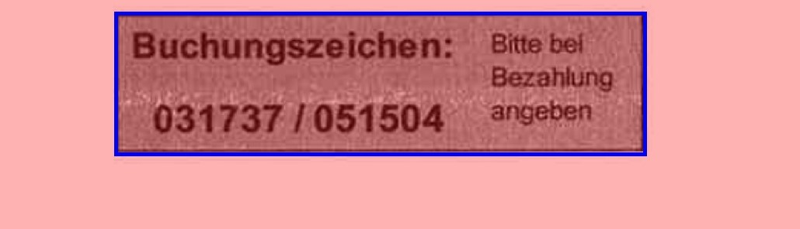

# Image text extract
The following explanation is also included with examples in the img_auto_mask_explanation.html

- __Auto_mask_image__
    given an image path, returns a Dataframe with information such as coordinates of the masks,and if saving path is defined for it, it will save the DataFrame as an xlsx file.

    - __inner_table_texts__
        - First it uses __scikitting(black_region=0, unite_boxes=0)__ to find the table fields.(It finds closed white regions) 
            -  For each region from above(each table field) it applies __scikitting(black_region=1, unite_boxes=1, minDist=40)__ to find closed black regions(text characters), and uses __unite_close_boxes__ to merge them together if they are close by __minDist__ distance or overlap.
            - It then returns a DataFrame containing the coordinates of the merged text boxes.
        - Now the texts outside of the tables should be found. For that we first set all pixels of the tables found in the first step to white and output it as __outer_img_array__.
    - __outer_table_texts__ gets __outer_img_array__ after being cleaned/eroded, and uses  __scikitting(black_region=1, unite_boxes=1, minDist=40)__ to find text characters of outside of the tables. 
    - The DataFrame containing the text boxes out of the table is then concatanated with the ones from inside of the tables.
    - __clean_and_calculate_columns__ gets the final DataFrame of text coordinates and remove boxes whose geometries(area and aspect ratio) does not make sense. It also writes the information of such geometries in the DataFrame.
    
- __show_labels__ takes the output DataFrame of __Auto_mask_image__ along with the image array, and plots the masks

#### Coordinates legend:
- image_array[top, left] returns the array element on top-left of the bounding bod
- image_array[Y_coordinate2, X_coordinate2] returns the array element on bottom-right of the bounding bod
- __img_mask_cut(image_array, box)__  returns the array_cut of the mask given a row of the DataFrame which has the coordinates:

    image_array[ 
               box['top']: box['Y_coordinate2'],   
               box['left']: box['X_coordinate2']
               ]
               
- __get_upper_labels__ 
    - __until_n_boxes__ above the __target_box__ (pandas row serries from the above DataFrame) that have have at least __n_letters_thr__ letters inside them, it it returns a sorted list of these texts.
- __get_left_labels__
    - __until_n_boxes__ left side of the __target_box__ (pandas row serries from the above DataFrame) that have have at least __n_letters_thr__ letters inside them, it returns a sorted list of these texts.
    
   
 - example: assume our __target_box__ has the coordinates of top == 2456 and left == 1426
 
 # Sub functions 
- __errosion_and_extrapolation__ takes an image array and tries to remove horizontal and vertical lines.
- __scikitting__ uses scikit-image to find regions, and optionally merges the found regions
    - if __make_img_label_overlay__, it returns an array of the image, colored by the detected regions. This is a time consuming part and good only for plotting.
    - if __black_region__, it looks if it can draw borders in whight regions around a black regions. Otherwise (for finding table fileds) it tries to draw a border in black regions around white regions
    - if __unite_boxes__, it merges the found masks using if the are close by __minDist__ distance or overlap. For meging __unite_close_boxes__ function is used inside __scikitting__ function
    - __area_threshold__ is the minimum area for the found regions inside the image to be accepted and saved in the DataFrame.
    - __thresholding__ is the thresholding method used for the initial image processing. Options: __'mean'__(default), __'niblack'__
    
# Where it may fail:

-  If image is tilted.---------> solution: Do tilt correction before everything else. Ask the user to be careful.
  

- Handwriting, stamp, coffee stain etc. ---------> solution: Ask the user not write on the paper or write far from numbers.

- The MinDist parameter may be too large.---------> solution: decreasing MinDist or make it dynamic.
  

- More than one row may merge.---------> solution: Modifying the criteria of being in one row, e.g. more strict assignment.
  

- Black background (rare)---------> solution: image processing. 

- Detected blank masks (may not be problamatic in general)---------> solution: tesseract confidece output or image processing.

